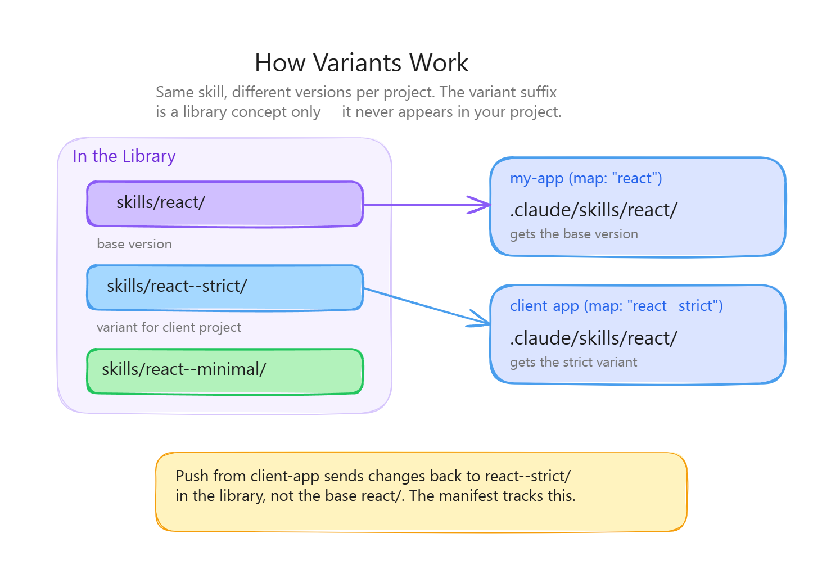

# claude-fast-library

If you use Claude Code across multiple projects, you're probably copying the same skills, agents, and settings between them. When you improve a skill in one project, the others fall behind. When you set up a new project, you manually reconstruct the `.claude/` folder from memory.

This library solves that. One repo holds everything. Each project picks what it needs. Changes flow both ways. The entire system is controlled through natural language via the `/library` command.

<p align="center"><a href="diagrams/variants.png"></a></p>

## Getting Started

You need [Claude Code](https://docs.anthropic.com/en/docs/claude-code) and the [GitHub CLI](https://cli.github.com/) (`gh auth login`).

### Option A: Start from this template (recommended)

1. Download the [`library.md`](commands/library.md) command file
2. Place it at `.claude/commands/library.md` in any project
3. Open Claude Code and say:

```
/library let's set up my own library
```

Claude will:

- Create your private repo from this template
- Install the auto-sync hook in your current project
- Import your existing `.claude/` content
- Connect everything

### Option B: Manual setup

```bash
# Create your private repo from this template
gh repo create my-library --template Abdo-El-Mobayad/claude-fast-library --private --clone

# In your project, init and sync
cd my-project
node ../my-library/sync.mjs --seed --name "CLAUDE--my-project"
```

After either option, everything is `/library` from here on.

## What It Manages

| Category        | What it is                            | Example                                         |
| --------------- | ------------------------------------- | ----------------------------------------------- |
| **Skills**      | Domain knowledge bases (folders)      | `react/`, `git-commits/`, `auth/`               |
| **Agents**      | Specialist sub-agent definitions      | `backend-engineer.md`, `frontend-specialist.md` |
| **Commands**    | Slash commands (`/build`, `/plan`)    | `build.md`, `team-plan.md`                      |
| **Hooks**       | Automation scripts                    | `FormatterHook/`, `SkillActivationHook/`        |
| **Rules**       | Auto-loaded context files             | `repo-primer.md` (per project)                  |
| **CLAUDE.md**   | Behavioral instructions               | One per project or profile                      |
| **Settings**    | Hook config, permissions, status line | `settings.json` per project                     |
| **MCP configs** | Model Context Protocol servers        | `.mcp.json` per project/platform                |
| **Files**       | Anything else                         | justfile, .gitignore, .editorconfig             |

## Using /library

Once set up, `/library` is your single interface. Just talk:

```
/library sync                                --> Pull latest from library
/library what's out of sync?                 --> Show diff table
/library push my changes                     --> Push with confirmation
/library add the payment-processing skill    --> Add to this project
/library I built a new skill, add it         --> Create new library item
/library create a variant of react           --> Project-specific version
/library set up my-new-repo                  --> Connect another project
/library create a profile called minimal     --> Reusable item selection
/library add react to the dev profile        --> Update a profile
/library is auto-sync working?               --> Check LibraryHook status
/library show everything                     --> Full inventory
```

## How Sync Works

**Sync** pulls from the library into your project. **Push** sends your local edits back.

```
Library ----sync----> Project     (library overwrites project)
Library <---push----- Project     (project overwrites library)
Library <---diff----> Project     (compare only, no changes)
```

```bash
node sync.mjs                              # sync current directory
node sync.mjs --push                       # push all changes
node sync.mjs --push -y                    # push without confirmation
node sync.mjs --diff                       # compare project vs library
node sync.mjs --all                        # sync every mapped project
node sync.mjs --list                       # show full inventory
node sync.mjs --add skills react           # add item to this project
node sync.mjs --remove skills archon       # remove item
node sync.mjs --init --profile dev         # init from a profile
node sync.mjs --seed --name "CLAUDE--app"  # import existing project
```

## Variants

The same skill can have different versions for different projects. Variants use a `name--suffix` convention in the library but deploy under the base name.

<p align="center"><a href="diagrams/hero-architecture.png"></a></p>

| In the library          | Deployed as             | Who gets it                        |
| ----------------------- | ----------------------- | ---------------------------------- |
| `skills/react/`         | `.claude/skills/react/` | Projects mapping `"react"`         |
| `skills/react--strict/` | `.claude/skills/react/` | Projects mapping `"react--strict"` |
| `CLAUDE--web-app.md`    | `CLAUDE.md`             | The web-app project                |

The variant suffix never appears in your project. Push sends changes back to the correct variant automatically.

## Profiles

Profiles are reusable item selections. Apply them when setting up new projects:

```bash
node sync.mjs --init --profile dev
node sync.mjs --add skills payment-processing   # stack more on top
node sync.mjs
```

Define profiles in `map.json`:

```json
{
  "profiles": {
    "dev": {
      "skills": ["react", "git-commits", "auth"],
      "agents": ["backend-engineer", "frontend-specialist"],
      "commands": ["build", "team-plan", "library"],
      "hooks": ["SkillActivationHook", "FormatterHook", "LibraryHook"],
      "rules": ["repo-primer--dev"],
      "claude-md": "CLAUDE--dev",
      "settings": "settings--dev"
    }
  }
}
```

## Auto-Sync

The LibraryHook automatically pushes local edits back to the library. No manual push needed.

**Two triggers:**

- **PostToolUse**: Fires when Claude edits a managed file
- **UserPromptSubmit**: Fires on each prompt, catches IDE/terminal edits via mtime scan

**180-second debounce**: rapid edits are batched into a single library commit. The worker is detached, so the push completes even if the session closes.

Disable/enable via `/library disable auto-sync` or `/library enable auto-sync`.

## Repository Structure

```
your-library/
├── sync.mjs                  # CLI engine (pure Node.js, zero deps)
├── map.json                  # Project and profile definitions
├── skills/                   # Skill folders (SKILL.md + supporting files)
├── agents/                   # Agent definitions (.md files)
├── commands/                 # Slash commands (.md files)
│   └── library.md            # The /library command itself
├── hooks/                    # Hook systems (folders with .mjs files)
│   └── LibraryHook/          # Auto-sync hook (included)
├── rules/                    # Rule files (.md, one per project variant)
├── claude-mds/               # CLAUDE.md files (one per project/profile)
├── settings/                 # settings.json files (one per project/profile)
├── mcp-configs/              # .mcp.json files (per project/platform)
├── files/                    # Arbitrary files with custom deploy paths
├── master-skill-rules.json   # Skill activation rules (filtered per project)
└── master-agent-rules.json   # Agent activation rules (filtered per project)
```

## Technical Details

- **Zero dependencies.** Pure Node.js (`fs`, `path`, `child_process`, `crypto`)
- **Cross-platform.** Windows, macOS, Linux
- **Git integration.** Sync pulls before operating. Push commits and pushes automatically
- **Hash-based diff.** MD5 comparison for files and directories
- **Ignore patterns.** Configure in `map.json` to exclude runtime artifacts from sync

## Credits

Built as part of [Claude Fast](https://claudefa.st) -- an AI development management system for Claude Code.
